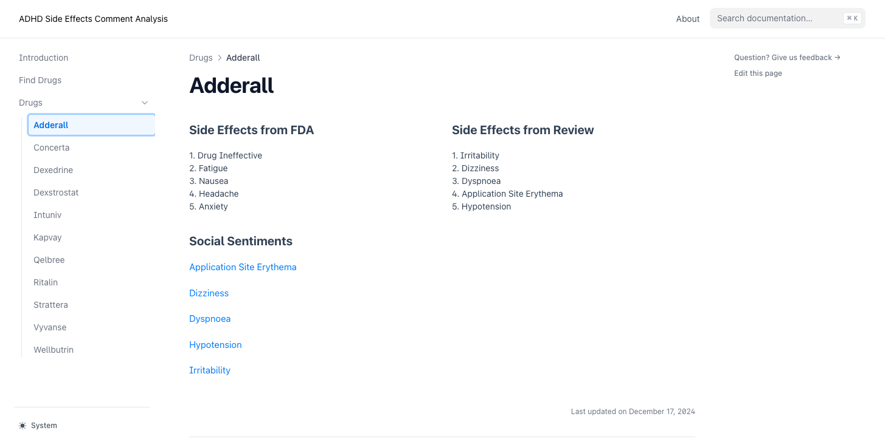
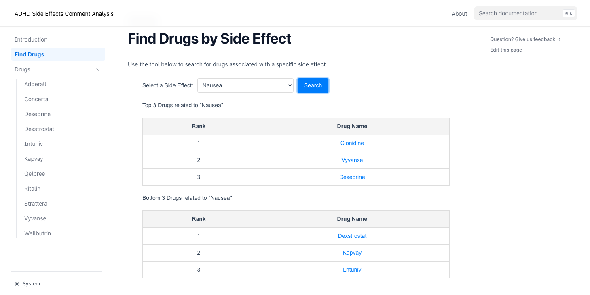

# **Side Effect Analysis Pipeline**

## **Project Overview**
This project analyzes user reviews from **Reddit** and **Drugs.com** to identify and rank potential **side effects** of ADHD medications. Using **BioBERT embeddings**, **keyword expansion**, **sentiment analysis**, and **similarity analysis**, the system extracts, scores, and ranks drug-related side effects from user-generated content.

The pipeline combines **Natural Language Processing (NLP)** and **machine learning** techniques to:
1. Preprocess and clean raw review data.
2. Expand official side effect keywords with **WordNet** and **BioBERT**.
3. Perform **sentiment analysis** to focus on negative user experiences.
4. Calculate similarity between user comments and expanded side effect keywords.
5. Rank side effects for each drug and extract relevant user comments.

---

## **Key Features**
1. **Data Collection and Cleaning**:
   - Reviews from **Reddit** and **Drugs.com** are preprocessed, cleaned, and stored in structured CSV files.
   <!-- - `side_effect.py` and `data_processing.py` handles **Drugs.com** reviews.
   - `data_processing_reddit.py` processes **Reddit** reviews. -->

2. **Sentiment Analysis**:
   - Negative comments are extracted using **VADER Sentiment Analyzer** (from NLTK).
   - Positive comments are removed to focus on reviews indicating adverse experiences.

3. **Keyword Expansion**:
   - Official side effect keywords are expanded using **WordNet synonyms** and **BioBERT embeddings**.
   - Enhances coverage and accuracy of side effect detection.

4. **Similarity Analysis**:
   - Computes **cosine similarity** between expanded keywords and user comment embeddings using BioBERT.
   - Identifies comments closely associated with specific side effects.

5. **Ranking and Scoring**:
   - Side effects are ranked based on their relevance scores.
   - Top K comments for each drug and side effect are extracted for analysis.

6. **Command-Line Arguments**:
   - `--process_data`: Preprocess input data before running the analysis.
   - `--drug`: Specify a list of drugs to analyze.
   - `--side_effect`: Specify side effects to focus the analysis on.

7. **Outputs**:
   - Cleaned and processed comments.
   - Ranked side effects and their relevance scores.
   - Comments most relevant to identified side effects.

---

## **Project Directory Structure**

```bash
├── data
│   ├── cleaned_reddit           # Cleaned Reddit review data
│   ├── raw_reddit               # Raw Reddit data
│   ├── simulants_reviews.csv    # Drugs.com simulants reviews
│   ├── non_simulants_reviews.csv # Drugs.com non-simulants reviews
│   └── side_effects.csv         # Official side effects (OpenFDA)
│
├── src
│   └── side_effect
│       ├── data_processing.py       # Processes Drugs.com reviews
│       ├── data_processing_reddit.py # Processes Reddit reviews
│       ├── embedding_and_keywords.py # BioBERT and WordNet for keyword expansion
│       ├── analysis.py              # Similarity and ranking analysis
│       └── side_effect.py           # Core utilities for cleaning & filtering (including sentiment analysis and selecting comments with at least 30 words)
│
├── output
│   ├── side_effect_scores.csv     # Ranked side effects with scores
│   ├── top_k_comments.csv         # Top K comments related to side effects
│   └── new_comment_dict.csv       # Processed comments with side effect matches
│
├── website                        # Front-end components for visualization
│   ├── components                 # React components
│   └── pages                      # Webpages for each drug
│
├── apply.py                       # Main script: runs the entire pipeline
├── README.md                      # Documentation (you are here)
├── LICENSE                        # Project license
└── requirements.txt               # Python dependencies
```

---

## **Pipeline Diagram**

Below is the high-level architecture of the side effect analysis pipeline:

The process of determining the most relevant comments for a given side effect is as follows:


The process for determining the number of most relevant comments and subsequently calculating the relevance score between the input drug and side effect is as follows:


## **Installation Package**

1. **Clone the Repository**

   First, clone the repository using Git:

   ```bash
   git clone https://github.com/xinzhouli00/side_effect.git
   cd side_effect
   ```

2. **Install Dependencies**

   Within the cloned directory, run the following command to install the project dependencies with Poetry:

   ```bash
   poetry install
   ```

   This command will create a virtual environment and install all the dependencies specified in the pyproject.toml file.

3. **Activate the Virtual Environment**

   ```bash
   poetry shell
   ```

4. **Running the Project**

   After installation, you can run the project's main application or scripts as follows:

   ```bash
   poetry run python src/side_effect/apply.py --process_data
   ```

   To analyze specific drugs and side effects:

   ```bash
   poetry run python src/side_effect/apply.py -d Adderall,Ritalin -se Insomnia,Nausea
   ```

5. **Updating Dependencies**

   To update the dependencies to their latest compatible versions, run:

   ```bash
   poetry update
   ```

---

## **Test**

Run tests using:

```bash
pytest -v tests
```

---

## **Usage**

1. **Prepare Input Data**:
   - Place raw Reddit and Drugs.com review data in the `data` directory.

2. **Run the Pipeline**:
   Execute the `apply.py` script to clean, process, and analyze the reviews:

   ```bash
   poetry run python src/side_effect/apply.py --process_data
   ```

   Analyze specific drugs and side effects:

   ```bash
   poetry run python src/side_effect/apply.py -d Adderall,Ritalin -se Insomnia,Nausea
   ```

3. **Output Files**:
   - `output/side_effect_scores.csv` contains ranked side effects.
   - `output/top_k_comments.csv` lists the most relevant user comments.
   - `output/{drug}_rank.csv` provides drug-specific side effect rankings.

---

## **Example Output**

| Drug Name  | Side Effect      | Score   | Comment                                      |
|------------|------------------|---------|----------------------------------------------|
| Adderall   | Insomnia         | 0.85    | "I couldn't sleep at all after taking this." |
| Vyvanse    | Nausea           | 0.78    | "This drug made me feel nauseous all day."   |
| Ritalin    | Headache         | 0.72    | "I developed a severe headache after use."   |

---

## **Demostration Website**

Our project processes three key data sources and converts them into JSON format for website visualization:

1. **User Reviews Analysis (`reviews.json`)**
2. **Side Effect Scores (`drugSideEffectsData.json`)**
3. **FDA Report Analysis (`formatted_drug_reactions.json`)**

Our `merge_data_json.py` script handles the conversion of CSV files to JSON format and their placement in the website directory:

```bash
project/
├── merge_data_json.py      # Data conversion script
├── output/                 # Processed CSV files
│   ├── side_effect_scores.csv
│   ├── drug_reactions.csv
│   └── merged_drug_data.csv
└── website/
    └── public/
        └── data/           # JSON files for website
            ├── reviews.json
            ├── drugSideEffectsData.json
            └── formatted_drug_reactions.json
```

### Processing Steps:
1. Script reads CSV files from `output/` directory
2. Converts data to appropriate JSON format
3. Automatically saves files to `website/public/data/`
4. Files become accessible to website components

### File Mapping:
- `side_effect_scores.csv` → `drugSideEffectsData.json`
- `drug_reactions.csv` → `formatted_drug_reactions.json`
- `merged_drug_data.csv` → `reviews.json`

These JSON files are placed in the `website/public/data/` directory and are utilized by the website for:
- Interactive visualizations
- Drug comparison features
- Side effect frequency analysis
- User experience insights

To run the website:
```bash
pnpm i        # Install dependencies
pnpm dev      # Start development server
```
Then visit localhost:3000 to view the interactive dashboard.

### How to Use Our ADHD Medication Side Effect Analysis Tool

Our website provides two main features to help users understand and compare ADHD medication side effects:

#### Individual Drug Pages

Each medication has a dedicated page showing:

1. **Side Effects Comparison**
  - FDA-reported side effects ranking
  - User review-based side effects ranking
  - Allows users to compare official data with real user experiences

2. **Social Sentiments**
  - Actual user comments and experiences
  - Provides real-world context for side effects

#### Find Drugs by Side Effect Feature

This tool helps users make informed decisions about medication choices:

1. **Search Function**
  - Select a specific side effect from dropdown menu
  - Click "Search" to view results

2. **Results Display**
  - Shows Top 3 drugs with strongest association to the selected side effect
  - Shows Bottom 3 drugs with weakest association
  - Helps users identify medications that might minimize specific side effects

3. **Interactive Navigation**
  - Click on any drug name to view its detailed page
  - Allows users to learn more about medications with promising profiles

This tool is particularly useful for:

- Users concerned about specific side effects
- Healthcare providers discussing medication options
- Anyone seeking to understand ADHD medication trade-offs

## **Team Members**
- **[Your Name]**
- **[Team Member 2]**
- **[Team Member 3]**
- **[Team Member 4]**

---

## **License**
This project is licensed under the MIT License. See the [LICENSE](LICENSE) file for details.

---

## **Acknowledgments**
- BioBERT model: [DMIS Lab](https://huggingface.co/dmis-lab/biobert-base-cased-v1.2)
- OpenFDA: Source for official side effects data.
- NLTK WordNet: For keyword expansion.
- VADER Sentiment Analyzer: For sentiment filtering.

---

This README provides a comprehensive overview of the project, including its objectives, structure, installation, usage, and outputs.
